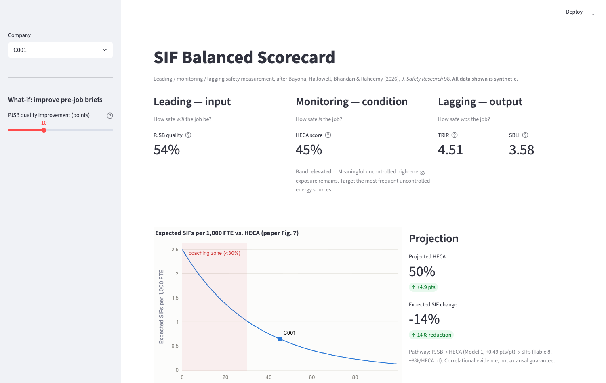

# SIF Balanced Scorecard

**A leading / monitoring / lagging safety measurement toolkit for serious
injury and fatality (SIF) prevention** — a working implementation of the
framework validated in Bayona, Hallowell, Bhandari & Raheemy (2026),
*"Balanced approach to serious injury and fatality prevention,"* Journal of
Safety Research 98, 175–189
([open access](https://doi.org/10.1016/j.jsr.2026.06.007)).



## Why

Most organizations still steer safety by TRIR — a lagging, frequency-based
rate that weighs a paper cut the same as a fatality and says nothing about
tomorrow's risk. The 2026 study measured 31 utility/construction companies
(361M worker-hours, 999 field assessments) and showed that two *short-term*
measures carry real signal about long-term SIF outcomes:

| Lens | Question | Instrument | Key result |
|---|---|---|---|
| **Leading** | How safe *will* the job be? | **PJSB quality** — 15-item weighted pre-job brief scorecard (CSRA) | +1 pt PJSB ≈ **+0.49 pt HECA** (p = .04) |
| **Monitoring** | How safe *is* the job? | **HECA** — % of high-energy hazards (>1,500 J) with a Direct Control | +1 pt HECA ≈ **−3% expected SIFs** (p = .02) |
| **Lagging** | How safe *was* the job? | **TRIR + SBLI** (severity-weighted rate) | Weighs injuries by consequence, not just count |

This repo implements all three instruments, the empirical risk model, the
assessor-reliability gates, and two delivery surfaces:

1. **Python package + Streamlit dashboard** — for analysts.
2. **[Microsoft 365 workflow](m365-implementation/README.md)** — a Copilot
   agent that scores pre-job briefs from Teams transcripts, SharePoint
   capture lists, Power Automate alerting, and a Power BI scorecard — for
   EHS teams to run every day with tools they already own.

## Quickstart

```bash
pip install -e ".[dashboard,dev]"
pytest                                # 39 tests
python examples/replicate_paper.py    # fit the paper's models on synthetic data
streamlit run dashboard/app.py        # three-lens scorecard dashboard
```

### Score a pre-job brief

```python
from sif_scorecard import score_pjsb

result = score_pjsb({1: True, 2: True, 3: True, 4: True, 5: True,
                     6: False, 7: True, 8: False, 9: True, 10: True,
                     11: True, 12: True, 13: True, 14: True, 15: False})
print(f"{result.quality:.0%}")          # 79%  (45/57 weighted points)
print(result.missing_statements[0])     # "8. All life-threatening hazards..."
```

### Project SIF risk from field observations

```python
from sif_scorecard import HazardObservation, heca_score, expected_sifs_per_1000_fte

task = heca_score([
    HazardObservation("Suspended load - crane pick", direct_control_present=True),
    HazardObservation("Fall from 12 ft - leading edge", direct_control_present=False),
])
print(task.score)                                # 0.5
print(expected_sifs_per_1000_fte(task.score))    # ~0.56 expected SIFs
```

### Gate your assessors before trusting their data

```python
from sif_scorecard import cohens_kappa, assessor_gate

kappa = cohens_kappa(rater_a_items, rater_b_items)
print(assessor_gate(kappa))   # qualified only if kappa > 0.40 (study's rule)
```

## What's in the box

```
src/sif_scorecard/
  pjsb.py         CSRA 15-item scorecard with official weights (max 57 pts)
  heca.py         High-Energy Control Assessment + Direct Control definitions
  lagging.py      TRIR and severity-based SBLI (Eq. 1-2)
  risk.py         Fig. 7 risk curve, PJSB->HECA->SIF pathway, coaching bands
  reliability.py  Cohen's kappa, ICC(2,k), the >0.40 assessor gate
  synthetic.py    Company-panel generator calibrated to the paper's Table 6
  models.py       Poisson / zero-inflated Poisson GLMs (Model 6 replication)
dashboard/        Streamlit three-lens scorecard + what-if projection
m365-implementation/
  copilot-agent/  Declarative agent that scores briefs from Teams transcripts
  sharepoint/     Capture list schemas
  power-automate/ Scoring, HECA<30% alerting, weekly digest flows
  power-bi/       DAX measures for the three-lens report
examples/         End-to-end replication of the paper's analysis
data/             Synthetic 31-company sample (no real data anywhere)
```

## Does the replication actually work?

`examples/replicate_paper.py` generates a synthetic panel calibrated to the
paper's descriptive statistics (Table 6), then fits the paper's count models.
The zero-inflated Poisson recovers the headline coefficient almost exactly:

| Relationship | Paper (Table 8) | Recovered on synthetic panel |
|---|---|---|
| SIF ~ HECA | **−0.03** / pt (p = .02) | **−0.029** / pt (p < .001) |
| FA ~ HECA | −0.02 / pt | −0.022 / pt |
| FT ~ HECA | −0.08 / pt | −0.037 / pt |

And the implemented risk curve reproduces the paper's Fig. 7 anchors: HECA
0 → 2.5 expected SIFs per 1,000 FTE, 0.5 → ~0.56, 0.9 → ~0.17.

## Operating thresholds encoded in the library

- **HECA < 30%** → coaching zone: "a SIF becomes a likely event."
- **Baseline protocol**: ≥15 PJSB + ≥15 HECA assessments, randomly sampled
  tasks/crews, within ≤3 months, before treating averages as stable.
- **Assessor gate**: Cohen's κ or ICC > 0.40, or the data doesn't count.

## Caveats

The published relationships are **correlational, company-level associations**
from North American utility and construction firms. They justify measuring
and improving brief quality and Direct Control coverage; they don't certify
any site as safe, and transfer to other industries is an open question. All
data in this repository is synthetic.

## Attribution

- Framework and empirical coefficients: Bayona, A., Hallowell, M. R.,
  Bhandari, S., & Raheemy, Y. (2026). *Journal of Safety Research*, 98,
  175–189 (CC BY-NC-ND 4.0).
- Pre-Job Safety Meeting Scorecard: [Construction Safety Research Alliance
  (CSRA)](https://csra.colorado.edu/qsl), University of Colorado Boulder.
- High-energy hazard / Direct Control concepts: Oguz Erkal & Hallowell
  (2023); [EEI's *The Power to Prevent*](https://www.eei.org/issues-and-policy/power-to-prevent).

Code is MIT-licensed. The scorecard instruments belong to their authors;
this repo implements them for research and educational use with attribution.
