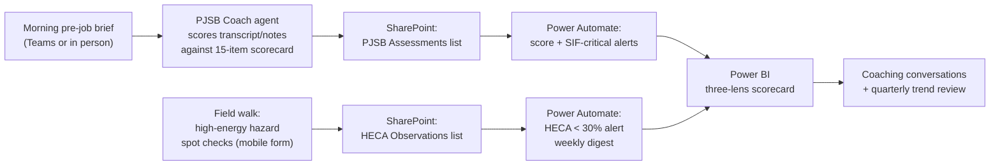

# M365 implementation: the daily SIF prevention workflow

This folder turns the measurement framework into a workflow EHS professionals
run every day using tools their organization already owns — Teams, Copilot,
SharePoint, Power Automate, and Power BI. No new software purchases.

## The daily loop

**Supervisor (2 minutes/day):** run the brief as usual; paste the transcript
or your notes to the **PJSB Coach** agent in Teams; get a score, the missed
items, and one coaching tip for tomorrow.

**EHS specialist (10 minutes/task, few per week):** on a field walk, log each
high-energy hazard and whether a Direct Control is present, from a phone.

**EHS manager (Monday mornings):** read the digest; coach where HECA < 30%
or where the same scorecard item keeps getting missed; report the three-lens
scorecard upward instead of TRIR alone.

## Setup order

| Step | What | Where | Doc |
|---|---|---|---|
| 1 | Create the two lists | SharePoint EHS site | [sharepoint/lists-schema.md](sharepoint/lists-schema.md) |
| 2 | Create the PJSB Coach agent | Copilot Studio / Agent Builder | [copilot-agent/instructions.md](copilot-agent/instructions.md) |
| 3 | Wire the three flows | Power Automate | [power-automate/flows.md](power-automate/flows.md) |
| 4 | Build the scorecard report | Power BI | [power-bi/measures.md](power-bi/measures.md) |

## Assessor calibration (do not skip)

The research only trusted field data from assessors who agreed with a
standard (Cohen's κ / ICC > 0.40). Before HECA numbers drive decisions,
run a calibration workshop: score 3 recorded briefs + 6 hazard photo sets
independently, then compute agreement with `sif_scorecard.reliability`
(see the repo root). Recalibrate annually or when assessors change.

## Rollout guardrails

- **Baseline first:** ≥15 PJSB + ≥15 HECA task assessments within ~3 months
  before treating scores as stable (the flows track this for you).
- **Coach, don't police:** scores rate *briefs*, not people. The fastest way
  to kill data quality is to attach individual consequences to it.
- **HECA < 30% is an act-now signal** — the study found a SIF becomes a
  likely event below it.
- **Keep lagging indicators in view** (TRIR *and* severity-weighted SBLI),
  but stop steering by them alone — that is the whole point.
